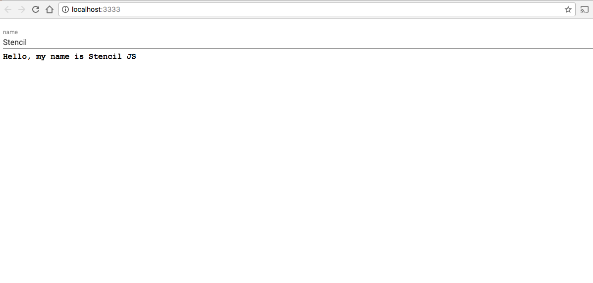

# Stencil Polymer Demo



This repo is a demonstration of how to use Polymer elements that are still in HTML imports with Stencil.

## Adding HTML Imports

There is a central imports file where you specify all of the HTML imports for
your app.

```bash
/src/polymer-imports.html
```

After adding imports to that file, you need to run the bundler script that will
bundle them into a single file.

```bash
npm run bundle
```

This will create the following file which is included in the `index.html`

```bash
/src/assets/bundle.html
```

## Getting Started

```bash
npm install
npm start
```

To view the build, start an HTTP server inside of the `/www` directory.

To watch for file changes during develop, run:

```bash
npm run dev
```

To build the app for production, run:

```bash
npm run build
```

